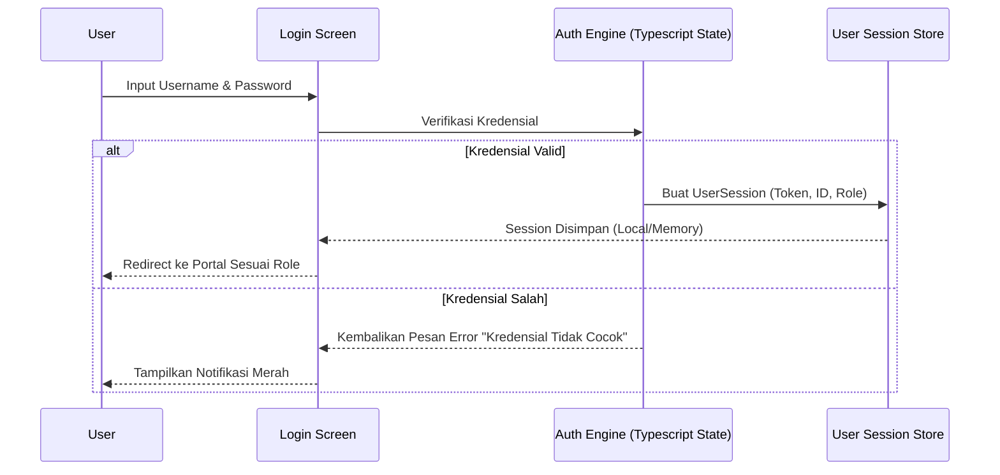

# PANDUAN DAN BLUEPRINT ARSITEKTUR METROMITRA
**Sistem Manajemen Koperasi Simpan Pinjam (KSP) Konvensional & Manajemen Investasi**

Dokumen ini disusun sebagai blueprint teknis, spesifikasi fungsional, dan manual integrasi sistem **MetroMitra** untuk digunakan sebagai basis konteks dalam **Google AI Studio**. Dokumen ini memastikan model kecerdasan buatan memahami seluruh siklus hidup aplikasi (11 Fase Pengembangan), arsitektur data, serta fungsionalitas akuntansi yang patuh pada standar koperasi konvensional di Indonesia.

---

## FASE 1: DEFINISI PRODUK & KEBUTUHAN BISNIS (PRD)

### 1. Visi Produk
**MetroMitra** (sebelumnya MetroCOOP) adalah platform manajemen koperasi full-stack modern yang dikembangkan untuk mendukung transisi digital Koperasi Simpan Pinjam (KSP) konvensional di Indonesia. Aplikasi ini menggabungkan layanan keuangan inti koperasi dengan unit usaha ritel (Point of Sale), penyewaan aset, transaksi digital (PPOB), serta modul mutakhir **Manajemen Investasi & Penyertaan Modal (Venture Capital)**.

### 2. Kepatuhan Regulasi & Standar Akuntansi
Aplikasi dirancang dengan kepatuhan penuh terhadap hukum regulasi koperasi konvensional di Indonesia:
*   **Hukum Positif:** UU No. 25 Tahun 1992 tentang Perkoperasian, PP No. 9 Tahun 1995 tentang Pelaksanaan Kegiatan Usaha Simpan Pinjam, dan Permenkop No. 2/2024.
*   **Standar Akuntansi:** Mengadopsi prinsip **SAK ETAP** (Standar Akuntansi Keuangan Entitas Tanpa Akuntabilitas Publik) dengan pelaporan keuangan baku (Neraca, Laba/Rugi, Sisa Hasil Usaha / SHU).
*   **Model Konvensional:** Semua bunga tabungan (simpanan sukarela) dan bunga pinjaman dihitung menggunakan persentase bunga flat/menurun konvensional, serta penyertaan modal dinilai berdasarkan kepemilikan saham langsung (ekuitas) dengan pembagian dividen berkala.

---

## FASE 2: DESAIN PENGALAMAN & ALUR PENGGUNA (USER FLOW)

Aplikasi ini memisahkan pengalaman pengguna ke dalam dua portal utama:
1.  **Portal Pengurus/Admin (Back-Office):**
    *   **Dashboard Keuangan:** Pemantauan Kas Koperasi, Total Aset, Rasio Kredit Bermasalah (NPL), dan Likuiditas.
    *   **Verifikasi & Persetujuan:** Manajemen pendaftaran anggota baru, verifikasi setoran simpanan manual via upload bukti transfer, pencairan pinjaman, dan persetujuan penarikan dana.
    *   **Kasir & Unit Usaha:** Kasir POS Ritel, manajemen stok barang, pembelian dari supplier, pencatatan transaksi sewa aset, dan top-up digital.
    *   **General Ledger (GL):** Pembuatan jurnal penyesuaian, bagan akun (Chart of Accounts - COA), dan penutupan laporan bulanan/tahunan.
2.  **Portal Anggota (Self-Service):**
    *   **Informasi Rekening:** Saldo Simpanan Pokok, Wajib, Sukarela, dan historis transaksi bunga.
    *   **Pengajuan Kredit & Pinjaman:** Simulasi cicilan bunga, formulir pengajuan pinjaman, dan riwayat pembayaran angsuran.
    *   **Akses Unit Usaha:** Portal belanja barang ritel koperasi secara kredit, pembelian pulsa/PPOB, dan pengaduan bantuan tiket.
    *   **Pengajuan Investasi (Investee):** Bagi anggota berstatus pelaku usaha (SME), portal menyediakan fitur pengajuan prospektus bisnis untuk mendapatkan penyertaan modal ventura dari koperasi.

---

## FASE 3: SPESIFIKASI TEKNIS & ARSITEKTUR

### 1. Tech Stack Utama
*   **Frontend:** React 18+ dengan Vite sebagai bundler super cepat.
*   **Bahasa:** TypeScript 5.x untuk menjamin keamanan tipe data (type-safety) dan mengurangi bug runtime.
*   **Styling:** Tailwind CSS untuk tampilan modern, responsif, menggunakan struktur "Bento Grid" premium dan warna kontras tinggi (Slate & Royal Blue).
*   **Animasi:** Motion (Framer Motion) untuk transisi halaman dan interaksi modal yang halus.
*   **State Management:** Reactive state terpusat untuk simulasi simulasi akuntansi instan (In-Memory Data Engine dengan dukungan sinkronisasi local).

### 2. Peta File Aplikasi (File Map)
```
/
├── src/
│   ├── App.tsx                    # Komponen utama & router portal
│   ├── main.tsx                   # Entry point aplikasi
│   ├── index.css                  # Konfigurasi Tailwind & Font Global (Inter, Mono)
│   ├── types.ts                   # Seluruh kontrak interface data TypeScript
│   ├── data.ts                    # Inisialisasi seed-data & konfigurasi COA
│   └── components/
│       ├── Header.tsx             # Navigasi atas dan judul modul dinamis
│       ├── Sidebar.tsx            # Menu navigasi berdasarkan peran aktif
│       ├── LoginScreen.tsx        # Gerbang login multibahasa (Admin/Member)
│       ├── AdminPortal.tsx        # Controller pusat views Admin
│       ├── MemberPortal.tsx       # Controller pusat views Anggota
│       └── admin/
│           ├── AdminAnggota.tsx   # CRUD Anggota & Profil Koperasi
│           ├── AdminSimpanan.tsx  # Pengaturan bunga tabungan & permohonan tarik
│           ├── AdminPinjaman.tsx  # Pengolahan angsuran kredit & bunga flat
│           ├── AdminVentura.tsx   # Manajemen Investasi Saham & Distribusi Dividen
│           ├── AdminLaporan.tsx   # Laporan Keuangan Neraca & Pembagian SHU
│           ├── AdminToko.tsx      # Kasir Ritel POS & Inventori Stok
│           └── AdminTema.tsx      # Pengaturan tema visual dinamis
```

---

## FASE 4: DESAIN KEAMANAN & AKSES (RBAC)

Keamanan aplikasi dikendalikan menggunakan **Role-Based Access Control (RBAC)** dengan empat peran pengguna utama:
1.  **Administrator Utama:** Akses penuh ke pengaturan sistem, aktivasi fitur (toggles), dan ekspor database.
2.  **Akuntan / Finance Officer:** Mengelola bagan akun (COA), menginput jurnal manual, memproses rekonsiliasi kas bank, dan mengesahkan laporan keuangan neraca/laba-rugi.
3.  **Pengurus Operasional:** Mengelola pendaftaran anggota, memproses permohonan pinjaman, memvalidasi bukti transfer simpanan, dan mengelola stok barang ritel.
4.  **Anggota Koperasi:** Akses terbatas hanya pada data pribadi, permohonan kredit/pinjaman sendiri, dan riwayat setoran tabungan.

### Alur Autentikasi (Auth Flow)


---

## FASE 5: DESAIN DATA & INTEGRASI

### 1. Skema Basis Data Inti (Database Schema)
Seluruh data dimodelkan dalam interface TypeScript yang tangguh pada file `/src/types.ts`:

#### A. Entitas Anggota (Anggota)
Mendokumentasikan data identitas pribadi serta posisi saldo simpanan riil:
```typescript
export interface Anggota {
  id: string;
  noAnggota: string;
  nama: string;
  email: string;
  nik: string;
  alamat: string;
  noHp: string;
  tanggalGabung: string;
  status: 'aktif' | 'nonaktif';
  saldoSimpananPokok: number;
  saldoSimpananWajib: number;
  saldoSimpananSukarela: number;
}
```

#### B. Entitas Pinjaman (Pinjaman)
Mencatat rincian kontrak kredit konvensional dengan perhitungan bunga tetap:
```typescript
export interface Pinjaman {
  id: string;
  anggotaId: string;
  anggotaNama: string;
  noPinjaman: string;
  jumlahPinjaman: number;
  sisaPokok: number;
  bungaPersen: number; // Persentase bunga tahunan konvensional
  tenorBulan: number;
  tanggalPengajuan: string;
  tanggalCair?: string;
  status: 'pengajuan' | 'disetujui' | 'dicairkan' | 'lunas' | 'ditolak';
  tujuan: string;
}
```

#### C. Entitas Penyertaan Modal / Investasi Saham (VentureInvestment)
Mencatat kepemilikan saham koperasi pada anak perusahaan atau startup binaan:
```typescript
export interface VentureInvestment {
  id: string;
  namaPerusahaan: string;
  sektorIndustri: string;
  namaFounder: string;
  nominalInvestasi: number;
  persentaseSaham: number; // Porsi kepemilikan saham koperasi (%)
  estimasiDividen: number;  // Target dividend yield tahunan (%)
  tanggalInvestasi: string;
  tenorTahun: number;
  status: 'pengajuan' | 'disetujui' | 'dicairkan' | 'selesai' | 'ditolak';
  deskripsiBisnis: string;
  kontakFounder: string;
  prospektusUrl?: string;
  dividendHistory: VentureDividend[];
}

export interface VentureDividend {
  id: string;
  tanggal: string;
  nominalDividen: number; // Dividen tunai masuk kas koperasi
  keterangan: string;
}
```

#### D. Entitas Buku Besar & Jurnal Otomatis (JournalEntry)
Sistem memiliki mesin otomatisasi jurnal (**Double-Entry Bookkeeping**) untuk menjamin kepatuhan SAK ETAP:
```typescript
export interface JournalEntry {
  id: string;
  noJurnal: string;
  tanggal: string;
  keterangan: string;
  debetAkun: string;  // Kode akun COA (misal: 1101 untuk Kas)
  kreditAkun: string; // Kode akun COA (misal: 4101 untuk Pendapatan Bunga)
  jumlah: number;
  tipe: 'simpanan' | 'pinjaman' | 'angsuran' | 'dividen' | 'penjualan' | 'manual';
}
```

---

## FASE 6: AKUNTANSI KOPERASI & AUTO-JOURNALIZATION

Setiap kali transaksi keuangan terjadi di sistem, sistem memanggil fungsi `createAutoJournal()` untuk mencatatnya ke Buku Besar Umum secara real-time. Berikut adalah pola pemetaan akun jurnal konvensional MetroMitra:

| Transaksi | Akun Debet (Dr) | Akun Kredit (Cr) | Deskripsi Standar |
| :--- | :--- | :--- | :--- |
| **Setoran Simpanan Pokok** | 1101 - Kas Bank Mandiri | 3101 - Simpanan Pokok | Menambah kas koperasi dan modal simpanan |
| **Pencairan Pinjaman** | 1201 - Piutang Pinjaman Anggota | 1101 - Kas Bank Mandiri | Pengurangan kas untuk penyaluran kredit |
| **Penerimaan Angsuran (Pokok)** | 1101 - Kas Bank Mandiri | 1201 - Piutang Pinjaman Anggota | Penerimaan cicilan pokok pinjaman |
| **Penerimaan Bunga Angsuran** | 1101 - Kas Bank Mandiri | 4101 - Pendapatan Bunga Pinjaman | Pencatatan laba operasional dari bunga flat |
| **Penerimaan Dividen Investasi** | 1101 - Kas Bank Mandiri | 4201 - Pendapatan Dividen Saham | Pencatatan hasil investasi modal ventura |
| **Penjualan Barang Kasir POS** | 1101 - Kas Bank Mandiri | 4301 - Pendapatan Unit Toko Ritel | Pendapatan operasional ritel toko |

---

## FASE 7: TARGET KINERJA & SKALABILITAS

*   **Kecepatan Render UI:** Di bawah 100ms menggunakan Virtual DOM React dan CSS modular Tailwind.
*   **Kecepatan Kalkulasi Laporan Keuangan:** Kurang dari 50ms untuk perhitungan otomatis Neraca, Laba/Rugi, dan SHU secara On-the-Fly melalui optimasi fungsi accumulator array JavaScript.
*   **Keamanan Eksekusi Operasi:** Menerapkan prinsip imutabilitas (immutability) pada state React, memastikan transaksi tidak dapat dimanipulasi di luar alur fungsi jurnal sah.

---

## FASE 8: RENCANA PENGUJIAN DAN QA

Aplikasi ini menggunakan pendekatan pengujian berjenjang:
1.  **Unit Testing (TypeScript Type Safety Check):** Melalui integrasi compiler `tsc --noEmit` untuk memverifikasi keakuratan pemanggilan type contract.
2.  **Linting (Code Quality Audit):** Memakai konfigurasi linter ESLint ketat guna menghindari bug memory leak akibat dependensi hook `useEffect`.
3.  **UAT (User Acceptance Testing) Checklist:**
    *   Verifikasi bahwa input bunga simpanan/pinjaman menghasilkan kalkulasi debet-kredit jurnal yang seimbang (balance).
    *   Uji batas maksimum portofolio investasi saham untuk memastikan koperasi tidak melakukan over-exposure modal pada satu anak perusahaan.

---

## FASE 9: LAYOUT DAN DESAIN VISUAL PREMIUM

Desain visual aplikasi ini berorientasi pada kenyamanan mata pengguna dalam durasi kerja panjang:
*   **Warna Latar:** Slate & Slate-50 yang bersih untuk panel utama, dikelilingi latar belakang netral bertekstur minimalis.
*   **Warna Aksen:** Royal Blue (untuk interaksi utama), Emerald Green (untuk riwayat transaksi surplus), Amber Gold (untuk indikator status pengajuan).
*   **Tipografi:** Font Sans-Serif **Inter** sebagai antarmuka utama, dikombinasikan dengan Font Monospace **JetBrains Mono** untuk angka keuangan, kode jurnal, dan kode rekening agar mudah dibaca oleh staf akuntansi.

---

## CONTOH PROMPT UNTUK INTERAKSI GOOGLE AI STUDIO

Anda dapat memberikan instruksi langsung kepada AI menggunakan konteks dalam dokumen ini. Berikut contoh skenario pengembangan lanjutan:

> *"Berdasarkan spesifikasi blueprint MetroMitra, tambahkan sebuah modal form pada `AdminLaporan.tsx` untuk melakukan pembagian Sisa Hasil Usaha (SHU) secara proporsional kepada seluruh anggota yang aktif berdasarkan akumulasi saldo simpanan mereka. Pastikan eksekusi ini menghasilkan jurnal otomatis (Double-Entry) dengan mendebet akun `3201 - SHU Belum Dibagi` dan mengkredit akun simpanan sukarela masing-masing anggota."*

---
*Dokumen ini merupakan panduan resmi arsitektur sistem MetroMitra. Seluruh modifikasi fungsionalitas dan pengembangan modul baru wajib mengikuti struktur, pola penamaan, kepatuhan konvensional, serta pola jurnal otomatis yang telah ditentukan di atas.*
